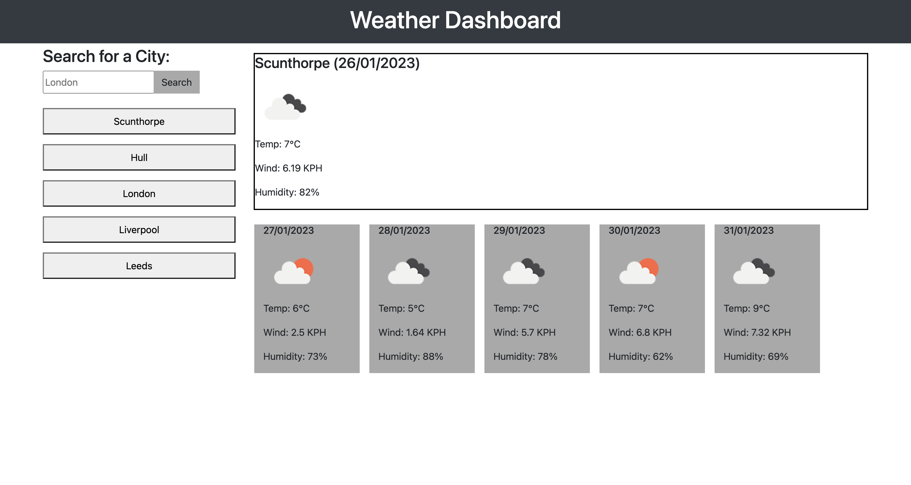

# 5-day-weather-dashboard

## Description

This repository was made to create 5-day weather dashboard. When a user searches for a city they are presented with current and future weather conditions for that city and that city is added to the search history, if a user refreshes the page up to 5 last searches can be seen and a user is represented with weather conditions for the last checked city.

## Usage

Simply tipe the name of the city in the input field and press the search button.

## Link

https://1eva1987.github.io/5-day-weather-dashboard/

## License

MIT License
